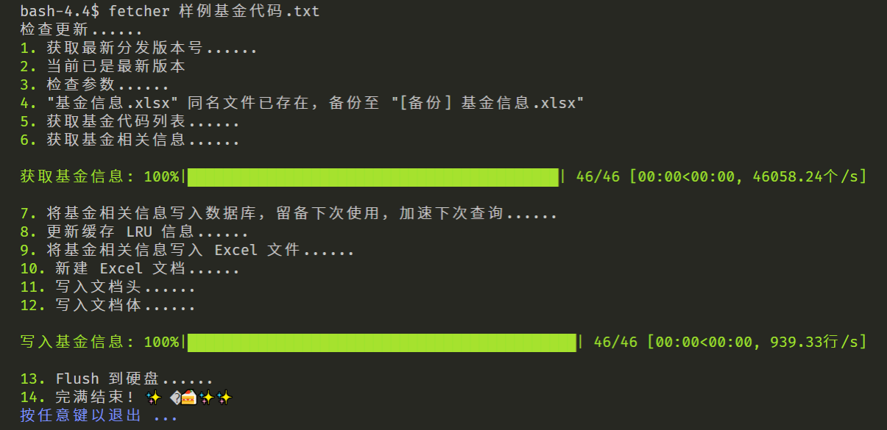
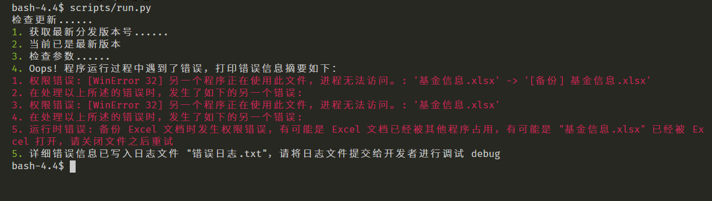
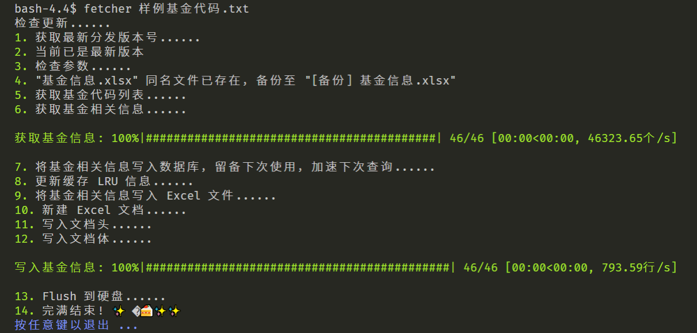

# 基金信息爬取与结构化器

<!-- TODO add badge about code coverage -->
<!-- TODO add badge about requires.io -->
<!-- TODO add badge about pylint rating -->
[](LICENSE)
[](https://travis-ci.com/MapleCCC/Fund-Info-Fetcher)
[](https://github.com/MapleCCC/Fund-Info-Fetcher/releases/latest)
[](https://github.com/semantic-release/semantic-release)
[](https://sloc.xyz/github/MapleCCC/Fund-Info-Fetcher)
[](https://github.com/psf/black)
[](https://github.com/MapleCCC/Fund-Info-Fetcher/compare/v1.4.0...master)
<!-- TODO which diff method should we use? two dots or three dots? -->

## TOC

<!-- START doctoc generated TOC please keep comment here to allow auto update -->
<!-- DON'T EDIT THIS SECTION, INSTEAD RE-RUN doctoc TO UPDATE -->


- [Overview](#overview)
- [Installation](#installation)
- [Usage](#usage)
  - [Example Output](#example-output)
- [Download](#download)
- [Development](#development)
  - [Test](#test)
  - [Release Strategy](#release-strategy)
- [Contribution](#contribution)
- [License](#license)

<!-- END doctoc generated TOC please keep comment here to allow auto update -->


## Overview

A script to fetch various fund information from `https://fund.eastmoney.com`, and structuralize into Excel document.

抓取天天基金信息，生成自定义表格。表头和样式可以在 `fetcher/schema.py` 自定义。

## Installation

Prerequisites: Python>=3.8, [Git](https://git-scm.com/), [pip](https://pip.pypa.io/en/stable/).

One-liner installation recipe:

```bash
$ python -m pip install git+https://github.com/MapleCCC/Fund-Info-Fetcher.git@v1.4.0#egg=Fund-Info-Fetcher
```

If editable mode installation is preferred:

```bash
# Optionally create a virtual environment for isolation purpose
$ python -m virtualenv .venv
$ source .venv/Scripts/activate

# Install in editable mode
$ python -m pip install -e git+https://github.com/MapleCCC/Fund-Info-Fetcher.git@v1.4.0#egg=Fund-Info-Fetcher
```

## Usage

```bash
$ fetcher <list of fund codes or files containing fund codes>

$ fetcher --help
"""
Usage: fetcher [OPTIONS] <fund codes or files containing fund codes>

  A script to fetch various fund information from
  https://fund.eastmoney.com, and structuralize into Excel document

Options:
  -o, --output TEXT       The output file path.  [default: 基金信息.xlsx]
  --disable-update-check  Disable update check.
  --version               Show the version and exit.
  --help                  Show this message and exit.

  Input file format: one fund code per line.
"""
```

### Example Output








## Download

Go to [Release](https://github.com/MapleCCC/Fund-Info-Fetcher/releases/latest) page.

## Development

Prerequisites: Git, Python3.8+, `pip`.

```bash
# Clone the repository to local environment
$ git clone https://github.com/MapleCCC/Fund-Info-Fetcher.git

$ cd Fund-Info-Fetcher

# Optionally create a virtual environment for isolation purpose
$ python -m virtualenv .venv
$ source .venv/Scripts/activate

# Install basic build requirements
$ python -m pip install -r requirements/install.txt

# Install dev requirements
$ python -m pip install -r requirements/dev.txt

$ python -m pip install -e .  # Mind the dot
```

Alternatively, just a one-liner:

```bash
# Optionally create a virtual environment for isolation purpose
$ python -m virtualenv .venv
$ source .venv/Scripts/activate

$ python -m pip install -e git+https://github.com/MapleCCC/Fund-Info-Fetcher.git#egg=Fund-Info-Fetcher
```

<!-- TODO: Pre-commit hook -->
<!-- Use black and isort to format staged codes. -->
<!-- Generate TOC for README. -->
<!-- Concatenate content of TODO.md and CHANGELOG.md to README. -->

### Test

The project uses pytest and hypothesis as test framework. Property-based testing is adopted in favor of its flexibility and conciseness.

```bash
# Install test requirements
$ python -m pip install -r requirements/test.txt

# unit tests
$ make test
```

<!-- Use tox as test framework -->

### Release Strategy

We follow [semantic version convention](https://semver.org). Every tag pushed to GitHub triggers a Release event. Release workflow (a GitHub action) proceeds and publishes built assets (along with SHA256 hash digest for secure verification).

We follow [conventional commit message guideline](https://www.conventionalcommits.org/en/v1.0.0/).

## Contribution

Go to [issues](https://github.com/MapleCCC/Fund-Info-Fetcher/issues) to send issues or feedbacks. Pull requests are welcome.

## License

This project is currently licensed under terms of [MIT](LICENSE) license. Feel free to contribute, fork, modify or redistribute.
